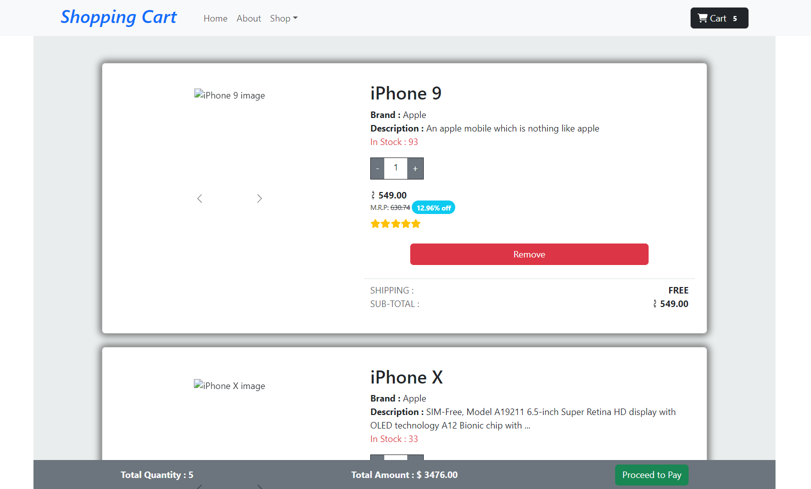

## React useContext Shopping Cart Page.



A dynamic shopping cart built with React Context API to manage item quantities, total quantity, and total amount. It updates automatically based on user interactions. This README guides you through the implementation and usage of the project.

## Implementation Overview

### 1. Fetch JSON Data
- Get the JSON data from [this link](https://drive.google.com/file/d/1fOadeM1liwbUK38z92F0XYugk2jwqK2r/view).

### 2. Create Context
- Create a context to manage cart state, including items, quantities, and totals.

### 3. Provide Context
- Wrap your application in the context provider to make the cart state accessible throughout the app.

### 4. Cart Page
- Implement the cart page to display items, quantities, prices, and totals.
- Include functionalities to increase, decrease, and remove items.

## Features

- **Dynamic Quantity Management**: Increase or decrease item quantities.
- **Automatic Calculation**: Total quantity and amount update dynamically.
- **JSON Data Integration**: Cart data is sourced from a JSON file.

## Technologies Used

- React
- Context API
- JavaScript
- HTML
- CSS

## How to Use It

1. **Clone the Repository:**
   ```bash
   git clone https://github.com/RAJKUMAR-35/React-UseContext-Cart

2. **Navigate to the project directory:**
   ```bash
   cd React-UseContext-Cart

3. **cd react-shopping-cart:**
   ```bash
   npm install

4. **Start the development server:**
   ```bash
   npm run dev

## Conclusion

This project demonstrates a comprehensive use of React Context API for managing a shopping cart system with dynamic updates, user feedback, and responsive design.


## Contact

For any inquiries or feedback, please contact:
- Name: Rajkumar A
- Email: rajkumaranbu192@gmail.com
- LinkedIn: [Rajkumar A](https://www.linkedin.com/in/rajkumar-cse/)
